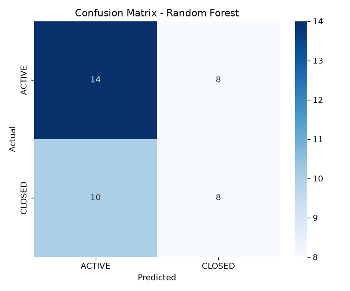
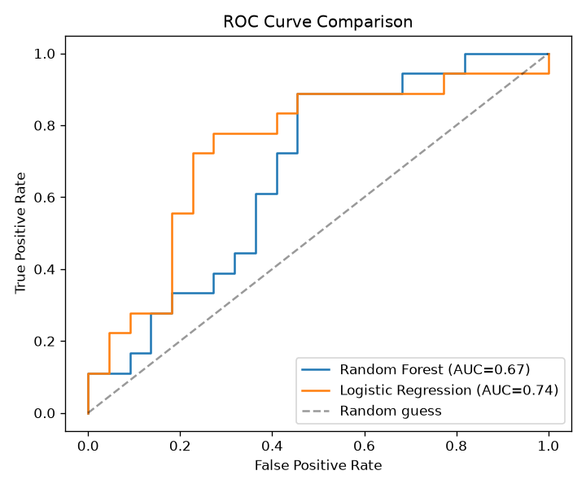
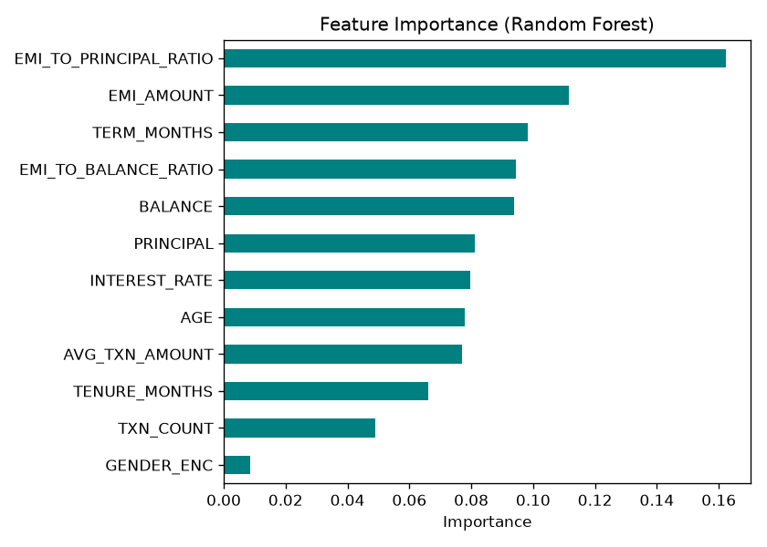

# Bank Loan Status Prediction

A machine learning mini project that predicts whether a bank loan is **ACTIVE** or **CLOSED**, using customer, account, transaction, and loan data stored in a relational **Oracle** database.

The project covers the full pipeline: relational schema design → SQL feature engineering → model training and comparison → evaluation and business insights.

> **Educational project.** The model is built on a small dataset and is not intended for real lending decisions.

---

## Highlights

| | |
|---|---|
| **Task** | Binary classification (`ACTIVE` vs `CLOSED`) |
| **Data** | 200 loans from a 4-table Oracle database (110 ACTIVE, 90 CLOSED) |
| **Features** | 12 inputs, including 2 engineered affordability ratios |
| **Models compared** | Logistic Regression (baseline) and Random Forest |
| **Best model** | **Logistic Regression** — 72.5% accuracy, ROC-AUC 0.74 |
| **Strongest predictor** | EMI-to-principal ratio |

---

## Table of Contents

1. [Database Schema](#database-schema)
2. [Feature Engineering with SQL](#feature-engineering-with-sql)
3. [Dataset](#dataset)
4. [Methodology](#methodology)
5. [Results](#results)
6. [Business Insights](#business-insights)
7. [Limitations](#limitations)
8. [Future Improvements](#future-improvements)
9. [Project Structure](#project-structure)
10. [How to Run](#how-to-run)
11. [Tech Stack](#tech-stack)
12. [Author](#author)

---

## Database Schema

The data comes from four linked Oracle tables. A customer can hold multiple accounts and loans, and each account can have many transactions.

| Table | Key columns | Purpose |
|---|---|---|
| `CUSTOMERS` | `CUSTOMERID` (PK), `DATEOFBIRTH`, `GENDER`, `CREATEDDATE` | Customer demographics (used to derive age and tenure) |
| `ACCOUNTS` | `ACCOUNTID` (PK), `CUSID` (FK), `BALANCE` | Account balance |
| `TRANSACTIONS` | `TRANSACTIONID` (PK), `ACCOUNTID` (FK), `AMOUNT`, `TXTDATE` | Deposits and withdrawals |
| `LOANS` | `LOAN_ID` (PK), `CUSTOMER_ID` (FK), `PRINCIPAL`, `INTEREST_RATE`, `TERM_MONTHS`, `EMI_AMOUNT`, `LOAN_STATUS` | Loan details and the **prediction target** |

The full entity-relationship diagram is in [`er_diagram.md`](er_diagram.md).

---

## Feature Engineering with SQL

All four tables are joined into a single feature table with **one row per loan**. Age and tenure are derived from date columns, balance comes from `ACCOUNTS`, and transaction activity is aggregated per account. Two ratios capture loan affordability:

- **EMI-to-Principal ratio:** the installment relative to the loan size
- **EMI-to-Balance ratio:** the installment relative to the customer's balance

```sql
SELECT l.LOAN_ID, l.CUSTOMER_ID, l.PRINCIPAL, l.INTEREST_RATE, l.TERM_MONTHS, l.EMI_AMOUNT,
       (l.EMI_AMOUNT / l.PRINCIPAL) AS emi_to_principal_ratio,
       c.GENDER,
       MONTHS_BETWEEN(SYSDATE, c.DATEOFBIRTH) / 12 AS age,
       MONTHS_BETWEEN(SYSDATE, c.CREATEDDATE)      AS tenure_months,
       a.BALANCE,
       (l.EMI_AMOUNT / a.BALANCE)                  AS emi_to_balance_ratio,
       NVL(t.txn_count, 0)                         AS txn_count,
       NVL(t.avg_txn_amount, 0)                    AS avg_txn_amount,
       l.LOAN_STATUS
FROM loans l
JOIN customers c ON l.CUSTOMER_ID = c.CUSTOMERID
JOIN accounts  a ON a.CUSID = c.CUSTOMERID
LEFT JOIN (
    SELECT ACCOUNTID, COUNT(*) AS txn_count, AVG(ABS(AMOUNT)) AS avg_txn_amount
    FROM transactions
    GROUP BY ACCOUNTID
) t ON t.ACCOUNTID = a.CUSID;
```

Additional exploration queries are in [`sql_insight_queries.sql`](sql_insight_queries.sql):

- Loan status distribution overall and by branch
- High EMI-burden customers (EMI > 15% of balance), as a risk watchlist
- Top 10 most financially active customers by transaction count
- Loan closure rate by term length
- Average age, tenure, and balance grouped by loan status
- Gender-wise and state-wise loan status breakdowns
- Dormant or low-activity accounts (fewer than 3 transactions)

---

## Dataset

The exported feature table contains **200 loans** with no missing values.

| Class | Loans | Share |
|---|---|---|
| ACTIVE | 110 | 55% |
| CLOSED | 90 | 45% |

**Features used for modeling**

| Feature | Description |
|---|---|
| `PRINCIPAL` | Original loan amount |
| `INTEREST_RATE` | Annual interest rate (%) |
| `TERM_MONTHS` | Loan duration in months |
| `EMI_AMOUNT` | Monthly installment |
| `EMI_TO_PRINCIPAL_RATIO` | EMI divided by principal |
| `EMI_TO_BALANCE_RATIO` | EMI divided by account balance |
| `GENDER_ENC` | Label-encoded gender |
| `AGE` | Customer age in years |
| `TENURE_MONTHS` | Months since the customer account was created |
| `BALANCE` | Current account balance |
| `TXN_COUNT` | Number of transactions |
| `AVG_TXN_AMOUNT` | Average absolute transaction amount |

**Target:** `LOAN_STATUS`, encoded as `CLOSED = 1` and `ACTIVE = 0`.

---

## Methodology

1. Export the joined feature table from Oracle to `loan_features.csv`.
2. Check the class distribution of `LOAN_STATUS`.
3. Encode the target and label-encode gender.
4. Split the data **80/20, stratified** (160 training and 40 test loans, `random_state=42`).
5. Standardize features for Logistic Regression.
6. Train both models.
7. Evaluate on the held-out test set and generate plots.
8. Save test-set predictions to `loan_predictions_output.csv`.

**Models**

| Model | Configuration |
|---|---|
| Logistic Regression | Standardized features, `class_weight="balanced"` (baseline) |
| Random Forest | `n_estimators=300`, `max_depth=6`, `class_weight="balanced"`, `random_state=42` |

---

## Results

### Model comparison (test set, 40 loans)

| Metric | Logistic Regression | Random Forest |
|---|---|---|
| Accuracy | **0.725** | 0.550 |
| Precision | **0.706** | 0.500 |
| Recall | **0.667** | 0.444 |
| F1 score | **0.686** | 0.471 |
| ROC-AUC | **0.740** | 0.672 |

**Logistic Regression outperformed Random Forest on every metric.** On a dataset this small (200 rows), a simpler, near-linear model often generalizes better than a more flexible ensemble, which is likely the case here.

### Confusion matrix (Random Forest)



### ROC curves



### Feature importance (Random Forest)



`EMI_TO_PRINCIPAL_RATIO` is the most important feature, followed by `EMI_AMOUNT`, `TERM_MONTHS`, and `EMI_TO_BALANCE_RATIO`. Gender contributes almost nothing.

> **Note:** Feature importances come from the Random Forest, which scored lower than Logistic Regression here. Treat the ranking as indicative rather than conclusive.

---

## Business Insights

- **Affordability drives outcomes.** Loans with a lower EMI-to-principal ratio are more likely to be closed.
- **Balance matters.** Customers with higher account balances tend to close loans sooner, likely because they can afford early repayment.
- **Term length has a clear effect.** Shorter-term loans mature and close faster than longer ones.
- **Transaction activity is a secondary signal.** Frequency and average amount contribute modestly.

---

## Limitations

- **Small dataset.** 200 loans, with only 40 in the test set, so metrics can swing noticeably between splits.
- **No cross-validation or hyperparameter tuning.** Results come from a single train/test split.
- **Status is not risk.** `ACTIVE` vs `CLOSED` describes whether a loan is still running, not whether a customer defaulted or paid late.
- **Static features.** There is no repayment or missed-payment history, so behavior over time is not captured.
- **Simple encoding.** Gender uses label encoding; the model should not be used for decisions affecting real people without a fairness review.

---

## Future Improvements

- Add a payment/EMI-history table to track missed and late payments directly
- Use a larger dataset and add cross-validation and hyperparameter tuning
- Test Gradient Boosting or XGBoost alongside the current models
- Add SHAP-based explanations for individual predictions
- Build a Streamlit dashboard or REST API connected to the Oracle database for live scoring

---

## Project Structure

```
predicting-loan-status-/
├── loan_status_prediction.py         # Trains and evaluates both models, creates plots
├── save_model.py                     # Saves the trained model
├── predict_new_loan.py               # Predicts the status of a new loan
├── sql_insight_queries.sql           # SQL queries for feature extraction and insights
├── er_diagram.md                     # Entity-relationship diagram
├── loan_features.csv                 # Feature table exported from Oracle (input)
├── loan_predictions_output.csv       # Test-set predictions (output)
├── confusion_matrix.png
├── roc_curve.png
├── feature_importance.png
├── Loan_Status_Prediction_Report.docx  # Full project report
└── README.md
```

---

## How to Run

**1. Clone the repository**

```bash
git clone https://github.com/Suman-git-code/predicting-loan-status-.git
cd predicting-loan-status-
```

**2. Create a virtual environment (optional) and install dependencies**

```bash
python -m venv venv
venv\Scripts\activate        # Windows
# source venv/bin/activate   # macOS / Linux

pip install pandas numpy matplotlib seaborn scikit-learn
```

**3. Add the data**

Place the exported feature table in the project folder as `loan_features.csv`. It must contain these columns:

```
LOAN_ID, CUSTOMER_ID, LOAN_STATUS, GENDER, PRINCIPAL, INTEREST_RATE, TERM_MONTHS,
EMI_AMOUNT, EMI_TO_PRINCIPAL_RATIO, EMI_TO_BALANCE_RATIO, AGE, TENURE_MONTHS,
BALANCE, TXN_COUNT, AVG_TXN_AMOUNT
```

`LOAN_STATUS` must be either `ACTIVE` or `CLOSED`.

**4. Run the project**

```bash
python loan_status_prediction.py
```

This trains both models, prints the evaluation metrics, and saves the plots and `loan_predictions_output.csv`.

**Example output (`loan_predictions_output.csv`)**

| LOAN_ID | CUSTOMER_ID | LOAN_STATUS | Predicted_Status | Probability_Closed |
|---|---|---|---|---|
| 32 | 32 | ACTIVE | ACTIVE | 0.312 |
| 163 | 163 | ACTIVE | CLOSED | 0.742 |
| 40 | 40 | ACTIVE | ACTIVE | 0.190 |

---

## Tech Stack

- **Database:** Oracle (SQL Developer)
- **Language:** Python 3
- **Libraries:** pandas, NumPy, scikit-learn, matplotlib, seaborn
- **IDE:** PyCharm

---

## Author

**Suman P**
MCA Student, Presidency College, Bengaluru
[GitHub](https://github.com/Suman-git-code) · [LinkedIn](https://www.linkedin.com/in/stdsam) · sumanp527579@gmail.com

---

*This project is for academic and educational purposes. You are free to modify and use it for learning and experimentation.*
