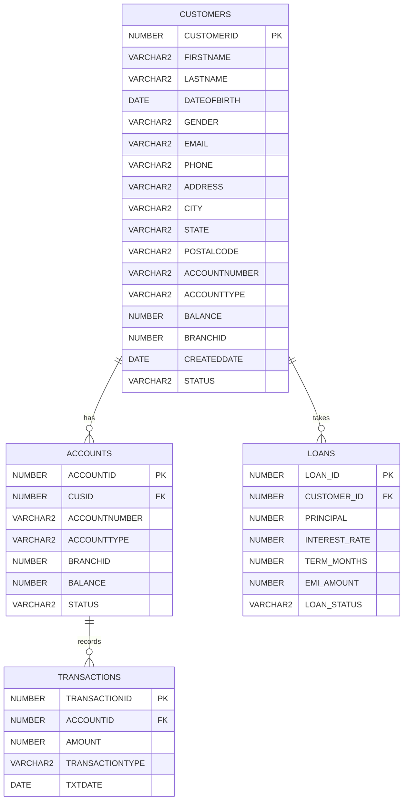

# ER Diagram — Bank Loan Prediction Mini Project

## Relationship summary
- **CUSTOMERS → ACCOUNTS**: one-to-many (one customer can hold multiple accounts; in this project, 1 account per customer)
- **CUSTOMERS → LOANS**: one-to-many (one customer can take multiple loans; in this project, 1 loan per customer)
- **ACCOUNTS → TRANSACTIONS**: one-to-many (each account has many transaction records over time)

## Notes on schema design
- `ACCOUNTS.CUSID` is the foreign key referencing `CUSTOMERS.CUSTOMERID`
- `LOANS.CUSTOMER_ID` is the foreign key referencing `CUSTOMERS.CUSTOMERID`
- `TRANSACTIONS.ACCOUNTID` is the foreign key referencing `ACCOUNTS.ACCOUNTID`
- `CUSTOMERS` and `ACCOUNTS` both carry `ACCOUNTNUMBER`, `ACCOUNTTYPE`, and `BALANCE` — a denormalization worth mentioning in your report as an area for schema improvement (in a fully normalized design, these would live only in `ACCOUNTS`)
